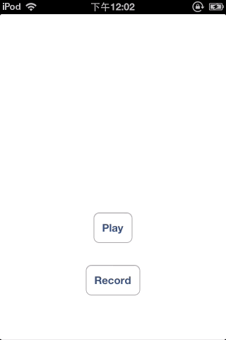

# ZWVoiceRecorderHudView
A hud view that presents a sinusoid curve with amplitude varying according to the voice intensity. Can be used for "press and talk" button such as the one found in WeChat.

一个屏幕覆盖视图，以正弦波的形式展示音频录制的过程，振幅依据说话声音的大小而变化。可用于微信等里的“按住 说话”等按钮。在DEMO中有完整的“按住说话”“释放结束”“上拉取消”的实例，并带有自己写的播放器。



## Installation

Add the `ZWVoiceRecorderHudView.h` and `ZWVoiceRecorderHudView.m` source files to your project.

## Usage

``` objective-c

Step 1.
To init the hud view with your controller view.
- (instancetype)initWithParentView:(UIView *)view;

Step 2.
Start recording by passing the file path you want to save the audio archive to this method.
- (void)startForFilePath:(NSString *)filePath;

Step 3.
Stop or cancel recording according to the user‘s interaction event.
- (void)stopRecording;
- (void)cancelRecording;

Optional.
You can tweak the recording parameters in `ZWVoiceRecorderHudView.m`, please see Apple Doc for more.
NSMutableDictionary * recordSetting = [NSMutableDictionary dictionary];
[recordSetting setValue :[NSNumber numberWithInt:kAudioFormatAppleIMA4] forKey:AVFormatIDKey];
[recordSetting setValue:[NSNumber numberWithFloat:16000.0] forKey:AVSampleRateKey];
[recordSetting setValue:[NSNumber numberWithInt: 1] forKey:AVNumberOfChannelsKey];

```

## License

[MIT license](LICENSE.md). 